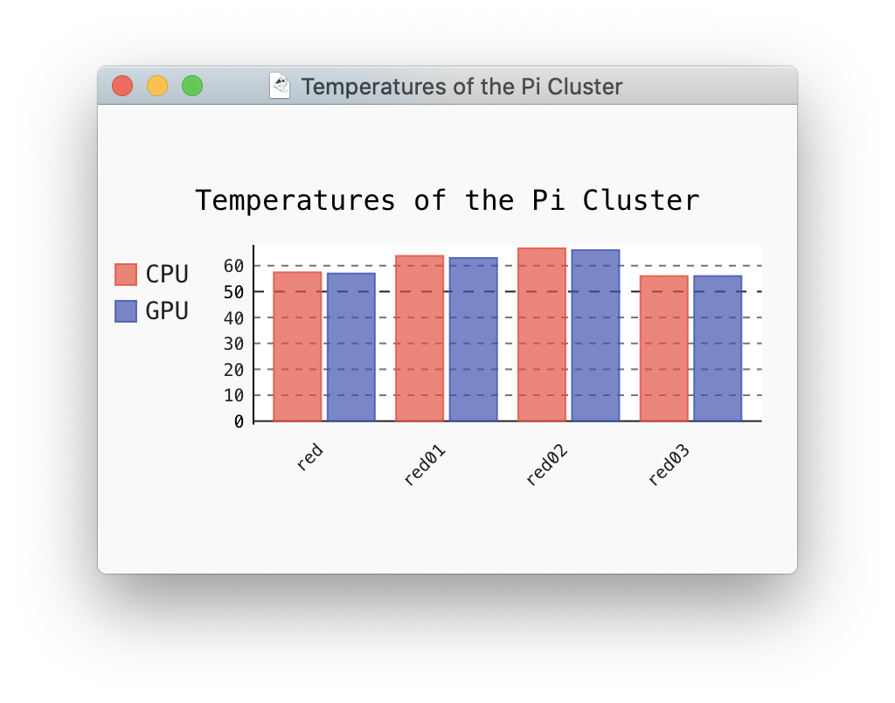
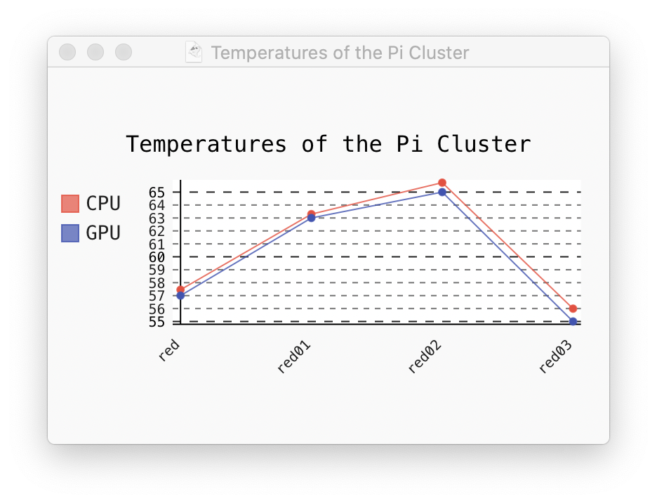
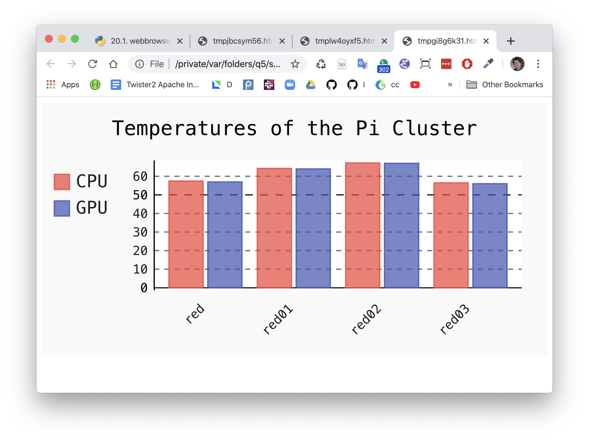
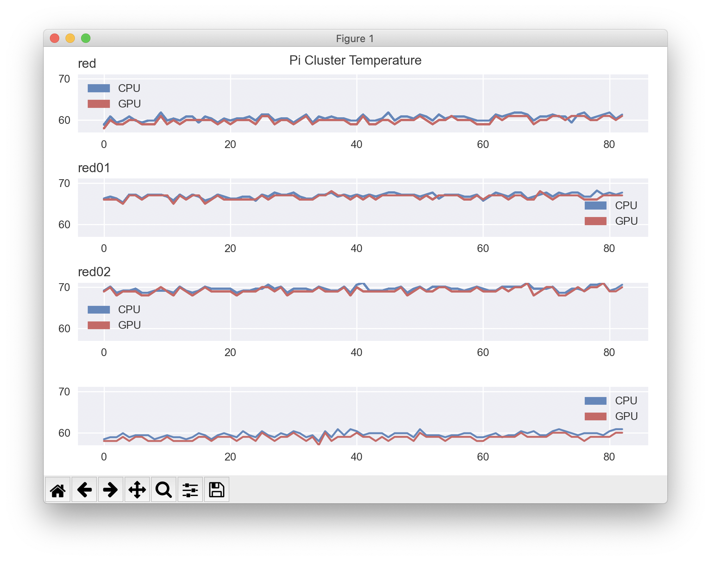

# Documentation

This README is managed in 

* [README.md](https://github.com/cloudmesh/cloudmesh-pi-cluster/blob/master/README.md)
* <https://github.com/cloudmesh/cloudmesh-pi-cluster>

## Prerequisite

Set up cloudmesh on the master 

```bash
$ sudo apt-get update
$ sudo apt-get full-upgrade
$ sudo apt-get install emacs
$ ssh-keygen
$ echo 'alias python="/usr/bin/python3"' >> ~/.bashrc
$ source .bashrc
$ python --version
$ python -m venv ~/ENV3
$ source ~/ENV3/bin/activate
$ pip install pip -U 
$ pip install cloudmesh-installer 
$ cloudmesh-installer get pi
```

## Setting LEDS

``` bash
$ cms pi led green on
$ cms pi led green off
$ cms pi led red on
$ cms pi led red off
```

## Getting the Temperature

Please note that the times are not exact as there is a slight delay
between getting the data and getting the data form the Pi.

```bash
cms pi temp "red,red[01-03]"
+-------+--------+------+----------------------------+
| host  | cpu    | gpu  | date                       |
+-------+--------+------+----------------------------+
| red   | 56.965 | 56.0 | 2020-03-28 14:34:46.926618 |
| red01 | 62.322 | 62.0 | 2020-03-28 14:34:46.949065 |
| red02 | 65.731 | 65.0 | 2020-03-28 14:34:46.933548 |
| red03 | 55.017 | 54.0 | 2020-03-28 14:34:47.218047 |
+-------+--------+------+----------------------------+
```

## Watching the temperature continiously

To watch the temperature continiously in the termoinal, use a repeat rate.  
To end the  program press CTRL-C

```bash
cms pi temp "red,red[01-03]" --rate=1.0
```

## Graph

### Sparkline

```bash
cms pi temp "red,red[01-03]"  --output=sparkline
▄▆█▃
```

### Bar

```bash
cms pi temp "red,red[01-03]"  --output=bar
```



### Line

```bash
cms pi temp "red,red[01-03]"  --output=line
```




### Browser

```bash
cms pi temp "red,red[01-03]"  --output=browser
```



### Live animation

A live animation is available with

```bash
cms pi temp "red,red[01-03]" --rate=1 --output=live
```



## Memory

```bash
cms pi free "red,red[01-03]" --rate=1
```

```
+-------+-----------+----------+----------+------------+-----------+-----------+------------+-----------+-----------+
| host  | mem.total | mem.used | mem.free | mem.shared | mem.cache | mem.avail | swap.total | swap.used | swap.free |
+-------+-----------+----------+----------+------------+-----------+-----------+------------+-----------+-----------+
| red   | 4.1 GB    | 109.5 MB | 3.8 GB   | 42.4 MB    | 188.2 MB  | 3.8 GB    | 104.9 MB   | 0 Bytes   | 104.9 MB  |
| red01 | 4.1 GB    | 99.8 MB  | 3.8 GB   | 34.0 MB    | 177.1 MB  | 3.8 GB    | 104.9 MB   | 0 Bytes   | 104.9 MB  |
| red02 | 4.1 GB    | 108.8 MB | 3.8 GB   | 34.0 MB    | 176.1 MB  | 3.8 GB    | 104.9 MB   | 0 Bytes   | 104.9 MB  |
| red03 | 4.1 GB    | 100.5 MB | 3.8 GB   | 34.0 MB    | 176.4 MB  | 3.8 GB    | 104.9 MB   | 0 Bytes   | 104.9 MB  |
+-------+-----------+----------+----------+------------+-----------+-----------+------------+-----------+-----------+
```

This can also be invoked repeatedly with

```
cms pi free "red,red[01-03]" --rate=1.0
```